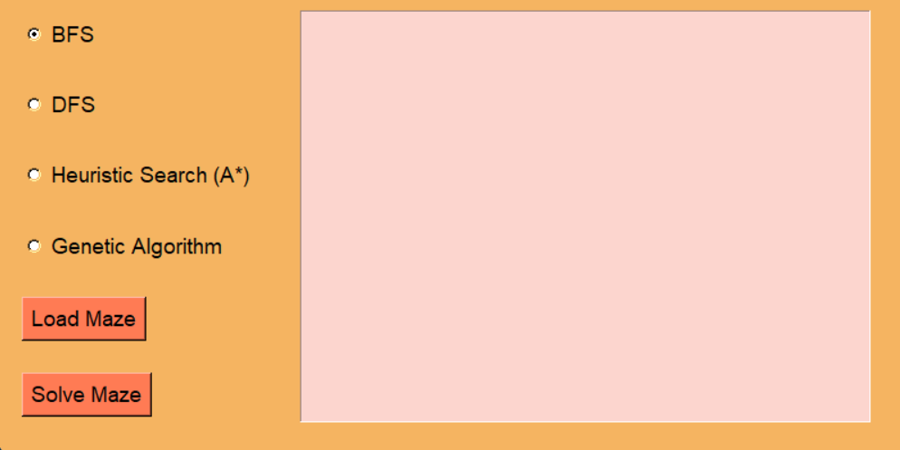

# The Ultimate Maze  solver

## About
### Team Members :
#### Adham Hisham Kandil 22P0217
#### Ahmed Mohmed Lotfy  22P0251 

This project consists of two parts: An maze generator and an automatic Maze solver. 

Folder _Mazes_ contains 5 mazes generated with this method.

There are Four ways that you can choose from the to solve the maze for comparison.
* `dfs` uses DFS (Depth First Search) to solve the maze blindly. It's inefficient (most of the times runs through the whole maze to find the solution).
* `bfs` uses DFS (Breadth First Search) to solve the maze blindly. It's inefficient (most of the times runs through the whole maze to find the solution).
* `a_star` uses A* algorithm (its an informed algorithm that takes decissions based on a cost funtion).

* `genetic_algorithm` uses GA algorithm (t generates a population of possible solutions and evolves them over time based on fitness, crossover, and mutation.).

  
This is the GUI of our Program

  

### For more info about these alogrithms:
* info on A* search algorithm: https://en.wikipedia.org/wiki/A*_search_algorithm
* info on DFS algorithm: https://en.wikipedia.org/wiki/Depth-first_search
* info on BFS algorithm: https://en.wikipedia.org/wiki/Breadth-first_search
* info on the GA algorithm: https://en.wikipedia.org/wiki/Genetic_algorithm 
